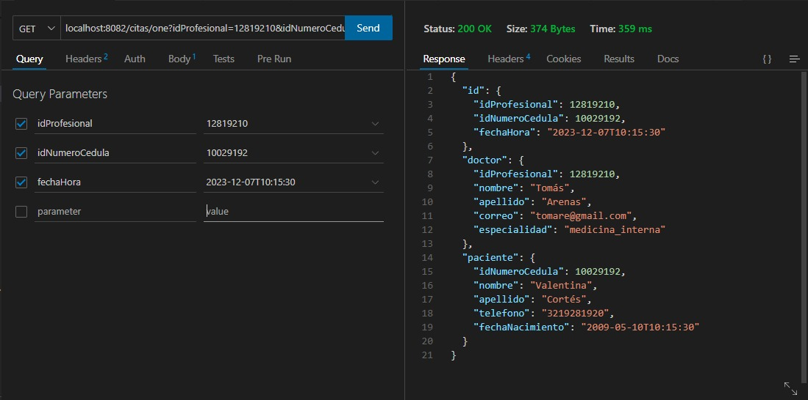

## Proyecto API REST con Java Springboot Módulo 15
---
## Topics :memo:

:open_file_folder: Este repositorio contiene los siguientes temas:

1. Contexto de la API
2. Tecnologías empleadas.
3. Estructuración de la base de datos.
4. Pasos para la instalación y uso de la API.
5. EndPoints de la API.
6. Pruebas de la API
7. Desarrolladores.
<br>

## 1. Contexto
---
Esta API se desarrolló para el curso de Desarrollo web Backend intermedio con la finalidad de emplear y demostrar los conocimientos adquiridos durante las clases vistas en donde, el proyecto final del curso consiste en crear una API REST con java spring boot simulando el comportamiento de un sistema médico que permite realizar diferentes acciones como crear, visualizar, editar y eliminar los pacientes, doctores y/o citas, logrando así evidenciar el uso de los métodos de petición HTTP y de las diferentes tecnologías aprendidas


## 2. Tecnologías empleadas
---
Para la realización de la API, se hizo uso de las siguientes tecnologías:

| Tecnología | Documentación |
| ------ | ------ |
| Java | https://www.java.com/es/ |
| Springboot | https://spring.io/ |
| MySQL | https://dev.mysql.com/doc/ |

## 3. Estructuración de la base de datos
---
Para la creación de la base de datos de la API se empleo el siguiente modelo entidad relación:


Modelo Relacional:


# 4. Pasos para la instalación y uso de la API
---
1. Instalación de un editor de texto (Visual Studio Code)
2. Instalación de las siguentes extensiones: <br>


3. Instalación del JDK:

 Dar click en las teclas ctrl+shift+p, escribir JDK y dar click en la unica opción que aparecera


4. Escoger la version mas estable (17) para iniciar la descarga


5. Clonar este repositorio 
sh
git clone https://github.com/su usuario/basic_api_rest.git
cd basic_api_rest

6. Ir a la terminal de MySQL o al Workbench y ejecutar el siguiente query:
```sh
create database NombredelaBD;
```

7. Dentro de la carpeta resources, reemplazar el nombre de la base de datos (línea 9) y el password escribiendo la contraseña de mysql (línea 11) 


8. Por último, ejecutar el archivo principal dando click en "Run"


# 5. EndPoints de la API
---
Para el API creamos los siguientes Endpoints:
#### Endpoints para pacientes
| Metodo   |        Endpoint           | Descripción |
| ------   |--------------             | --------    |
| `get`    | `/pacientes`          | Obtener los datos de todos los pacientes |
| `get`    | `/pacientes/{id}`    | Obtener los datos del paciente por ID |
| `get`    | `/pacientes/{id}/citas`  | Obtener las citas por el id del paciente  |
| `post`    | `/pacientes` | Crea el registro de un paciente |
| `put`    | `/pacientes/{id}`       | Actualizar los datos del paciente |
| `delete` | `/pacientes/{id}`       | Eliminar el registro del paciente |

<br>

#### Endpoints para doctores
| Metodo   |        Endpoint           | Descripción |
| ------   |--------------             | --------    |
| `get`    | `/doctores`          | Obtener los datos de todos los doctores |
| `get`    | `/doctores/{id}`    | Obtener los datos del doctor por ID |
| `get`    | `/doctores/especialidad/{especialidad}`| Obtener doctores por especialidad |
| `get`    | `/doctores/{id}/citas` | Obtener las citas que tiene programada el doctor por id  |
| `post`    | `/doctores` | Crea el registro de un doctor |
| `put`    | `/doctores/{id}`       | Actualizar los datos del doctor |
| `delete` | `/doctores/{id}`       | Eliminar el registro del doctor|

<br>

#### Endpoints para citas
| Metodo   |   Endpoint   | Descripción |
| ------   |--------------    | --------    |
| `get`    | `/citas`          | Obtener las citas |
| `get`    | `/citas/one`    | Obtener los datos de las citas por ID |
| `post`    | `/citas` | Crea el registro de una cita |
| `put`    | `/citas`       | Actualizar la cita |
| `delete` | `/citas`       | Eliminar el registro de una cita|

# 6. Pruebas de la API
---
Para cuestion de nuestras pruebas, usamos la extension de Visual Studio Code `Thunder Client`
A continuación vamos a mostrar las pruebas de cada uno de los métodos

### Pruebas para pacientes
Obtener todos los pacientes
<br>

Obtener el paciente por id


Obtener todas las citas de un paciente en especifico


Crear paciente


Actualizar paciente


Eliminar paciente
<br><br>

### Pruebas para doctores


Obtener todos los doctores
<br>

Obtener el doctor por id


Obtener todos los doctores por especialidad


Obtener las citas programadas del doctor por id


Crear doctores


Actualizar doctores


Eliminar doctor
<br><br>

### Pruebas para citas

Obtener todas las citas


Obtener la cita por id


Crear citas


Actualizar cita


Eliminar cita


# 7. Desarrolladores
---
Este proyecto se desarrolló en colaboración de:
<br>
>:saxophone: María Alejandra Cruz 
>:whale2: Jorge Daniel Gómez 
>:smile_cat: Johan Sebastián Gónzalez 
---

original repository : https://github.com/norbeydanilo/api-citas-spring-boot.git
by: Norbey Danilo Muñoz